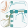
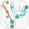

<picture>
  <source media="(prefers-color-scheme: dark)" srcset="assets/banner-dark.svg">
  <source media="(prefers-color-scheme: light)" srcset="assets/banner-light.svg">
  
</picture>

<p align="center">
  <a href="https://www.colemcintosh.io/">Website</a> ·
  <a href="https://staymellow.ai/">Mellow AI</a> ·
  <a href="https://www.linkedin.com/in/colemcintosh/">LinkedIn</a> ·
  <a href="mailto:cole@staymellow.ai">Email</a>
</p>

**Full-stack engineer and founder building dependable AI products.**

I design and ship production systems across the stack—from model integrations and data pipelines to the interfaces people use. My current focus is agentic workflows, structured extraction, and developer tools that make AI systems easier to trust and operate.


## Projects

Every mark below is generated from the project's own name: same name, same mark, every time.

| | Project | What it does |
| --- | --- | --- |
|  | [**OpenExtract**](https://github.com/Mellow-Artificial-Intelligence/openextract) | Turns documents, images, audio, and video into validated Pydantic models. |
|  | [**LangChain Salesforce**](https://github.com/colesmcintosh/langchain-salesforce) | Adds SOQL queries, schema inspection, and CRUD operations to LangChain. |
|  | [**pdfmd**](https://github.com/colesmcintosh/pdfmd) | Converts PDF files to Markdown with a fast Rust-based pipeline. |
|  | [**Vector Vault**](https://github.com/colesmcintosh/vector-vault) | Implements approximate vector search in Go using locality-sensitive hashing. |
|  | [**PyCUDA NumPy Vector Ops**](https://github.com/colesmcintosh/pycuda-numpy-vector-ops) | Accelerates NumPy vector operations with PyCUDA. |


## Open source

Contributions include [LangChain](https://github.com/langchain-ai/langchain/pulls?q=is%3Apr+author%3Acolesmcintosh+is%3Amerged), [smolagents](https://github.com/huggingface/smolagents/pulls?q=is%3Apr+author%3Acolesmcintosh+is%3Amerged), [LiteLLM](https://github.com/BerriAI/litellm/pulls?q=is%3Apr+author%3Acolesmcintosh+is%3Amerged), [Pydantic AI](https://github.com/pydantic/pydantic-ai/pulls?q=is%3Apr+author%3Acolesmcintosh+is%3Amerged), and [Goose](https://github.com/aaif-goose/goose/pulls?q=is%3Apr+author%3Acolesmcintosh+is%3Amerged).

## Toolkit

- **Languages:** TypeScript, Python, Rust, Go
- **Applications:** Next.js, React, Node.js
- **AI:** Pydantic AI, LangChain, retrieval, agents, structured outputs
- **Infrastructure:** AWS, Azure, Google Cloud


## About the artwork

The banner isn't a picture of anything. It's a simulation, and it makes the same argument my work does: **structure is not authored, it is what survives the constraints.**

A coherence gradient rises from left to right across the canvas. On the left it is zero, so every particle takes its heading straight from layered Perlin noise and draws the organic filaments of an unconstrained flow. As coherence climbs, each heading eases toward the nearest cardinal axis and each step snaps to the lattice pitch — turbulence becomes circuitry, one particle at a time. A mask of lattice cells sits in the middle as a constraint. Particles that pass through a masked cell deposit energy there and the cell brightens; particles that satisfy nothing leave dim residue. The name is never drawn. It accumulates, hit by hit, out of the traversals that happened to be valid.

Everything is a pure function of its seed, so the banner, the dividers, and the project marks all come from one deterministic system:

| File | Role |
| --- | --- |
| [`art/PHILOSOPHY.md`](art/PHILOSOPHY.md) | The movement — Schema Drift, stated as an aesthetic position. |
| [`art/schema-drift.js`](art/schema-drift.js) | The field: seeded PRNG, Perlin noise, the coherence gradient, the 5×7 lattice font. |
| [`art/render.js`](art/render.js) | Renders every SVG in [`assets/`](assets). No canvas, no rasterising — vectors all the way down. |
| [`art/viewer.html`](art/viewer.html) | An interactive p5.js viewer. Open it in a browser and watch a seed crystallise. |

```bash
node art/render.js              # rebuild the assets at the committed seed
node art/render.js --seed 88    # a different signature entirely
open art/viewer.html            # sliders, seed navigation, your own constraint text
```

<sub>Schema Drift · seed 2317 · rendered from `art/render.js` — no dependencies, no build step.</sub>
