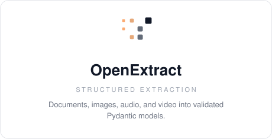
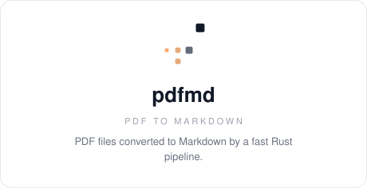
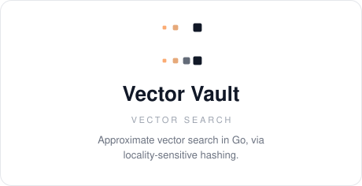
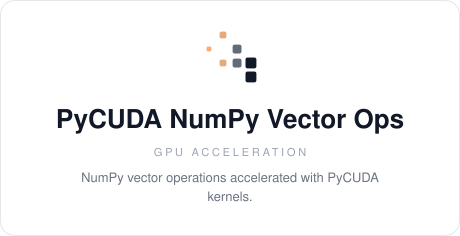

<picture>
  <source media="(prefers-color-scheme: dark)" srcset="assets/banner-dark.svg">
  <source media="(prefers-color-scheme: light)" srcset="assets/banner-light.svg">
  
</picture>

### Cole McIntosh

Founder @ [Mellow AI](https://staymellow.ai/) &nbsp;|&nbsp; [GitHub](https://github.com/colesmcintosh) · [LinkedIn](https://www.linkedin.com/in/colemcintosh/) · [X](https://x.com/colesmcintosh) · [Email](mailto:cole@staymellow.ai) &nbsp;|&nbsp; [Website](https://www.colemcintosh.io/)

I build agents and extraction systems that take work off the table for real teams. The bar is production quality — I own the system through launch, reliability, and the failure modes that only show up in real use.

`TypeScript` · `Python` · `Rust` · `Go`

## Projects

<a href="https://github.com/Mellow-Artificial-Intelligence/openextract"><picture><source media="(prefers-color-scheme: dark)" srcset="assets/card-openextract-dark.svg"></picture></a>
<a href="https://github.com/colesmcintosh/langchain-salesforce"><picture><source media="(prefers-color-scheme: dark)" srcset="assets/card-langchain-salesforce-dark.svg"></picture></a>

<a href="https://github.com/colesmcintosh/pdfmd"><picture><source media="(prefers-color-scheme: dark)" srcset="assets/card-pdfmd-dark.svg"></picture></a>
<a href="https://github.com/colesmcintosh/vector-vault"><picture><source media="(prefers-color-scheme: dark)" srcset="assets/card-vector-vault-dark.svg"></picture></a>

<a href="https://github.com/colesmcintosh/pycuda-numpy-vector-ops"><picture><source media="(prefers-color-scheme: dark)" srcset="assets/card-pycuda-numpy-vector-ops-dark.svg"></picture></a>

## Open source

Contributions include [LangChain](https://github.com/langchain-ai/langchain/pulls?q=is%3Apr+author%3Acolesmcintosh+is%3Amerged), [smolagents](https://github.com/huggingface/smolagents/pulls?q=is%3Apr+author%3Acolesmcintosh+is%3Amerged), [LiteLLM](https://github.com/BerriAI/litellm/pulls?q=is%3Apr+author%3Acolesmcintosh+is%3Amerged), [Pydantic AI](https://github.com/pydantic/pydantic-ai/pulls?q=is%3Apr+author%3Acolesmcintosh+is%3Amerged), and [Goose](https://github.com/aaif-goose/goose/pulls?q=is%3Apr+author%3Acolesmcintosh+is%3Amerged).

## Toolkit

**Languages** TypeScript, Python, Rust, Go &nbsp;·&nbsp; **Applications** Next.js, React, Node.js 
**AI** Pydantic AI, LangChain, retrieval, agents, structured outputs &nbsp;·&nbsp; **Infrastructure** AWS, Azure, Google Cloud
