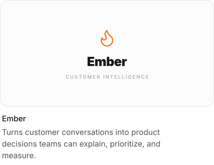
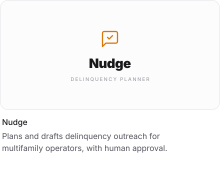
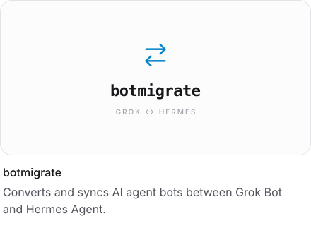
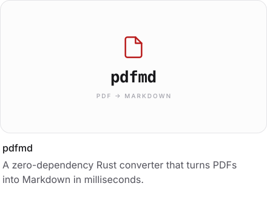
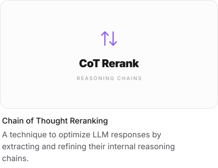

### Cole McIntosh

Founder @ [Mellow AI](https://staymellow.ai/) &nbsp;|&nbsp; [Website](https://www.colemcintosh.io/) · [LinkedIn](https://www.linkedin.com/in/colemcintosh/) · [X](https://x.com/colesmcintosh) · [Email](mailto:cole@staymellow.ai) &nbsp;|&nbsp; [Resume](https://www.colemcintosh.io/resume)

I'm Cole McIntosh, an AI engineer in Dallas, Texas, and the founder of Mellow AI. I build agents and extraction systems that take work off the table for real teams. The bar is production quality. I own the system through launch, reliability, and the failure modes that only show up in real use.

---

### Projects

  
  

  
  

  
  

### Open source

[OpenExtract](https://github.com/Mellow-Artificial-Intelligence/openextract) · [LangChain Salesforce](https://github.com/colesmcintosh/langchain-salesforce) · [LangChain](https://github.com/langchain-ai/langchain/pulls?q=is%3Apr+author%3Acolesmcintosh+is%3Amerged) · [Pydantic AI](https://github.com/pydantic/pydantic-ai/pulls?q=is%3Apr+author%3Acolesmcintosh+is%3Amerged) · [smolagents](https://github.com/huggingface/smolagents/pulls?q=is%3Apr+author%3Acolesmcintosh+is%3Amerged) · [LiteLLM](https://github.com/BerriAI/litellm/pulls?q=is%3Apr+author%3Acolesmcintosh+is%3Amerged) · [Goose](https://github.com/aaif-goose/goose/pulls?q=is%3Apr+author%3Acolesmcintosh+is%3Amerged)
